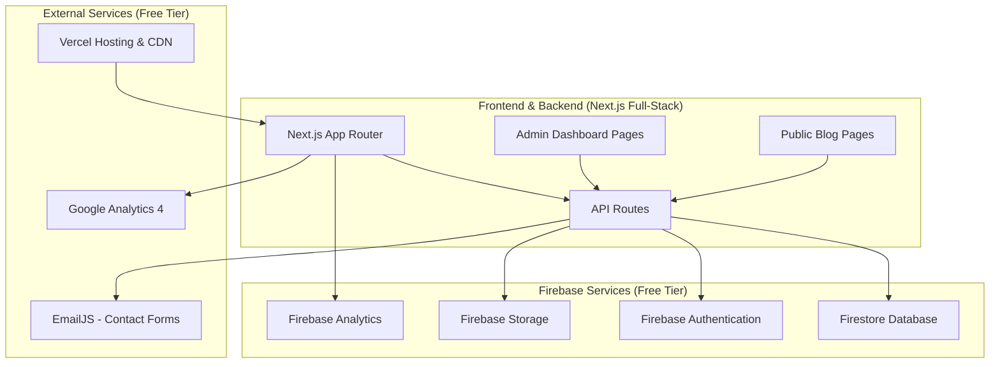

# Design Document

## Overview

The personal blog website will be built as a modern, full-stack web application using Next.js and Firebase services. This approach provides flexibility, performance, and scalability while maintaining ease of content management and keeping costs minimal with free-tier services. The system will feature a public blog interface for readers and a protected admin panel for content management, newsletter management, and WordPress-like site customization. The architecture is inspired by newmansub.com.ng's design and functionality but will contain completely original content.

## Architecture

### High-Level Architecture



### Technology Stack

**Frontend:**
- **Framework:** Next.js 14 with App Router
- **Language:** TypeScript
- **Styling:** Tailwind CSS
- **UI Components:** Headless UI / Radix UI
- **Rich Text Editor:** Tiptap or Quill.js
- **State Management:** Zustand or React Query
- **Form Handling:** React Hook Form with Zod validation

**Backend:**
- **Runtime:** Node.js 18+ (or serverless functions)
- **Framework:** Next.js API Routes (full-stack approach)
- **Database:** Firebase Firestore
- **Authentication:** Firebase Authentication (admin only)
- **File Upload:** Firebase Storage
- **Image Processing:** Firebase Storage with automatic optimization
- **Email:** EmailJS (free tier) or Firebase Extensions
- **Real-time Updates:** Firebase Firestore real-time listeners

**Database:**
- **Primary Database:** Firebase Firestore (NoSQL)
- **Authentication:** Firebase Auth
- **File Storage:** Firebase Storage
- **Analytics:** Firebase Analytics + Google Analytics 4

**DevOps & Deployment:**
- **Hosting:** Vercel (full-stack Next.js app)
- **CDN:** Vercel Edge Network (included)
- **Monitoring:** Vercel Analytics (free tier)
- **Analytics:** Firebase Analytics + Google Analytics 4

## Components and Interfaces

### Frontend Components

#### Public Interface Components
```typescript
// Public pages (no authentication required)
- HomePage (/): Article listings with pagination
- ArticlePage (/articles/[slug]): Individual article display
- CategoryPage (/category/[slug]): Category-filtered articles
- SearchPage (/search): Search results display
- AboutPage (/about): Author information and bio

// Shared components
- Header: Navigation and branding
- Footer: Links and contact information
- ArticleCard: Article preview component
- Pagination: Page navigation controls
- SearchBar: Article search functionality
- CategoryFilter: Category selection interface
- SocialShare: Social media sharing buttons
- NewsletterSignup: Email subscription form
- ContactForm: Contact form with EmailJS integration
```

#### Admin Dashboard Components (Protected Routes)
```typescript
// Admin-only pages (authentication required)
- AdminLogin (/admin): Login page for admin access
- AdminDashboard (/admin/dashboard): Overview and analytics
- AdminArticles (/admin/articles): Article management
- AdminEditor (/admin/articles/new): Create new article
- AdminEditor (/admin/articles/[id]/edit): Edit existing article
- AdminCategories (/admin/categories): Category management
- AdminMedia (/admin/media): Image and file management
- AdminNewsletter (/admin/newsletter): Newsletter subscriber management
- AdminCustomization (/admin/customize): Site appearance and layout settings
- AdminSettings (/admin/settings): Site configuration and SEO settings

// Admin-specific components
- AdminLayout: Protected layout wrapper with navigation
- ArticleEditor: Rich text editor for content creation
- ArticleList: Content management table
- CategoryManager: Category CRUD operations
- MediaLibrary: Image and file management
- NewsletterManager: Subscriber list and email campaign management
- SiteCustomizer: WordPress-like appearance customization panel
- ThemeEditor: Color schemes, fonts, and layout options
- Analytics: Traffic and engagement metrics
```

### Backend API Endpoints

#### Public API Routes
```typescript
// Article endpoints
GET /api/articles - List published articles with pagination
GET /api/articles/[slug] - Get single article by slug
GET /api/articles/category/[category] - Get articles by category
GET /api/search?q=query - Search articles

// Category endpoints
GET /api/categories - List all categories
GET /api/categories/[slug]/articles - Get articles in category

// Newsletter and contact endpoints
POST /api/newsletter/subscribe - Newsletter subscription
POST /api/newsletter/unsubscribe - Newsletter unsubscription
POST /api/contact - Contact form submission

// Site customization endpoints
GET /api/site/config - Get site configuration and theme settings

// Utility endpoints
GET /api/sitemap.xml - Generate sitemap
GET /api/rss.xml - Generate RSS feed
```

#### Admin API Routes (Protected)
```typescript
// Authentication (Firebase Auth - admin only)
POST /api/auth/login - Admin login with Firebase
POST /api/auth/logout - Admin logout
GET /api/auth/verify - Verify admin session

// Content management (Firestore operations - admin only)
GET /api/admin/articles - List all articles (including drafts)
POST /api/admin/articles - Create new article in Firestore
PUT /api/admin/articles/[id] - Update article in Firestore
DELETE /api/admin/articles/[id] - Delete article from Firestore
POST /api/admin/upload - Upload images to Firebase Storage

// Category management (admin only)
GET /api/admin/categories - List all categories
POST /api/admin/categories - Create new category
PUT /api/admin/categories/[id] - Update category
DELETE /api/admin/categories/[id] - Delete category

// Newsletter management (admin only)
GET /api/admin/newsletter/subscribers - List all subscribers
DELETE /api/admin/newsletter/subscribers/[id] - Remove subscriber
POST /api/admin/newsletter/send - Send newsletter to subscribers

// Site customization (admin only)
GET /api/admin/customize/theme - Get current theme settings
PUT /api/admin/customize/theme - Update theme settings
GET /api/admin/customize/layout - Get layout configuration
PUT /api/admin/customize/layout - Update layout configuration
PUT /api/admin/customize/branding - Update site branding (logo, colors, fonts)

// Analytics (Firebase Analytics integration - admin only)
GET /api/admin/analytics - Get site analytics from Firebase
GET /api/admin/analytics/articles/[id] - Get article-specific metrics
```

## Data Models

### Firestore Database Structure

```typescript
// Firestore Collections Structure

// articles collection
{
  "articles": {
    "article-id-1": {
      title: "Article Title",
      slug: "article-title",
      content: "Article content...",
      excerpt: "Brief description...",
      featuredImage: "gs://bucket/images/featured.jpg",
      categoryId: "category-id-1",
      tags: ["tag1", "tag2"],
      status: "published", // draft, published, archived
      metaTitle: "SEO Title",
      metaDescription: "SEO Description",
      readingTime: 5,
      viewCount: 0,
      createdAt: Timestamp,
      updatedAt: Timestamp,
      publishedAt: Timestamp
    }
  }
}

// categories collection
{
  "categories": {
    "category-id-1": {
      name: "Technology",
      slug: "technology",
      description: "Tech-related articles",
      color: "#3B82F6",
      createdAt: Timestamp
    }
  }
}

// tags collection
{
  "tags": {
    "tag-id-1": {
      name: "JavaScript",
      slug: "javascript",
      createdAt: Timestamp
    }
  }
}

// comments collection (subcollection of articles)
{
  "articles/article-id-1/comments": {
    "comment-id-1": {
      authorName: "John Doe",
      authorEmail: "john@example.com",
      content: "Great article!",
      status: "approved", // pending, approved, rejected
      createdAt: Timestamp
    }
  }
}

// subscribers collection
{
  "subscribers": {
    "subscriber-id-1": {
      email: "user@example.com",
      status: "active", // active, unsubscribed
      subscribedAt: Timestamp
    }
  }
}

// analytics collection (for custom tracking)
{
  "pageViews": {
    "view-id-1": {
      articleId: "article-id-1",
      timestamp: Timestamp,
      userAgent: "browser info",
      referrer: "source url"
    }
  }
}

// site configuration collection (WordPress-like customization)
{
  "siteConfig": {
    "theme": {
      primaryColor: "#3B82F6",
      secondaryColor: "#1F2937",
      fontFamily: "Inter",
      headerStyle: "modern", // modern, classic, minimal
      layoutStyle: "grid", // grid, list, masonry
      updatedAt: Timestamp
    },
    "branding": {
      siteName: "My Personal Blog",
      tagline: "Sharing thoughts and experiences",
      logo: "gs://bucket/branding/logo.png",
      favicon: "gs://bucket/branding/favicon.ico",
      updatedAt: Timestamp
    },
    "layout": {
      showSidebar: true,
      sidebarPosition: "right", // left, right
      articlesPerPage: 10,
      showAuthorBio: true,
      showRelatedPosts: true,
      updatedAt: Timestamp
    },
    "seo": {
      metaTitle: "My Personal Blog",
      metaDescription: "A personal blog about...",
      keywords: ["blog", "personal", "writing"],
      googleAnalyticsId: "GA_MEASUREMENT_ID",
      updatedAt: Timestamp
    }
  }
}
```

### TypeScript Interfaces

```typescript
interface Article {
  id: number;
  title: string;
  slug: string;
  content: string;
  excerpt?: string;
  featuredImage?: string;
  category: Category;
  tags: Tag[];
  status: 'draft' | 'published' | 'archived';
  metaTitle?: string;
  metaDescription?: string;
  readingTime: number;
  viewCount: number;
  createdAt: Date;
  updatedAt: Date;
  publishedAt?: Date;
}

interface Category {
  id: number;
  name: string;
  slug: string;
  description?: string;
  color?: string;
  articleCount?: number;
}

interface Tag {
  id: number;
  name: string;
  slug: string;
}

interface Comment {
  id: number;
  articleId: number;
  authorName: string;
  authorEmail: string;
  content: string;
  status: 'pending' | 'approved' | 'rejected';
  createdAt: Date;
}
```

## Error Handling

### Frontend Error Handling
- **Network Errors:** Retry mechanism with exponential backoff
- **404 Errors:** Custom 404 page with navigation suggestions
- **Loading States:** Skeleton components and loading indicators
- **Form Validation:** Real-time validation with clear error messages
- **Image Loading:** Fallback images and lazy loading with error boundaries

### Backend Error Handling
```typescript
// Centralized error handling middleware
interface ApiError {
  status: number;
  message: string;
  code?: string;
  details?: any;
}

// Common error responses
- 400 Bad Request: Invalid input data
- 401 Unauthorized: Authentication required
- 403 Forbidden: Insufficient permissions
- 404 Not Found: Resource not found
- 429 Too Many Requests: Rate limiting
- 500 Internal Server Error: Server-side errors
```

### Firebase Error Handling
- **Network Failures:** Firebase SDK automatic retry mechanisms
- **Permission Errors:** Firestore security rules validation
- **Quota Limits:** Graceful handling of free tier limitations
- **Offline Support:** Firebase offline persistence for better UX

## Testing Strategy

### Frontend Testing
```typescript
// Unit Tests (Jest + React Testing Library)
- Component rendering and props
- User interactions and event handling
- Form validation and submission
- Utility functions and hooks

// Integration Tests
- API integration with mock responses
- Route navigation and page rendering
- Search and filtering functionality

// E2E Tests (Playwright)
- Complete user workflows
- Article creation and publication
- Cross-browser compatibility
- Mobile responsiveness
```

### Backend Testing
```typescript
// Unit Tests (Jest)
- Next.js API routes functionality
- Firestore operations with Firebase emulator
- Firebase Authentication integration
- Firebase Storage file uploads

// Integration Tests
- Firebase services integration with emulator suite
- EmailJS integration (mocked)
- End-to-end admin workflows

// Performance Tests
- API response times
- Firestore query optimization
- Firebase Storage performance
```

### Security Testing
- **Authentication:** Firebase Auth token validation for admin routes
- **Route Protection:** Admin-only route access control testing
- **Input Validation:** XSS prevention and content sanitization
- **File Upload:** Malicious file detection and sanitization
- **Rate Limiting:** API abuse prevention testing
- **Admin Session:** Secure admin session management

## Performance Considerations

### Frontend Optimization
- **Code Splitting:** Route-based and component-based splitting
- **Image Optimization:** Next.js Image component with WebP support
- **Caching:** Browser caching and service worker implementation
- **Bundle Size:** Tree shaking and dynamic imports
- **Core Web Vitals:** LCP, FID, and CLS optimization

### Backend Optimization
- **Firestore Indexing:** Composite indexes for complex queries
- **Query Optimization:** Efficient Firestore queries with pagination
- **Caching Strategy:** Next.js built-in caching and ISR (Incremental Static Regeneration)
- **API Rate Limiting:** Vercel edge functions rate limiting
- **Image Processing:** Firebase Storage automatic optimization

### Infrastructure Optimization
- **CDN:** Vercel Edge Network for global content delivery
- **Firebase Connection:** Efficient Firebase SDK connection management
- **Serverless Scaling:** Vercel automatic scaling
- **Monitoring:** Vercel Analytics and Firebase Performance Monitoring